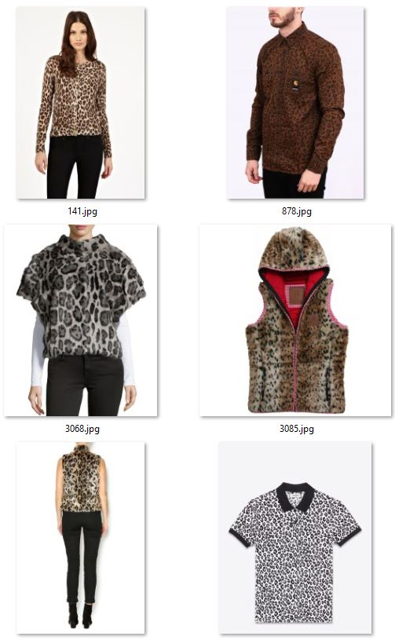
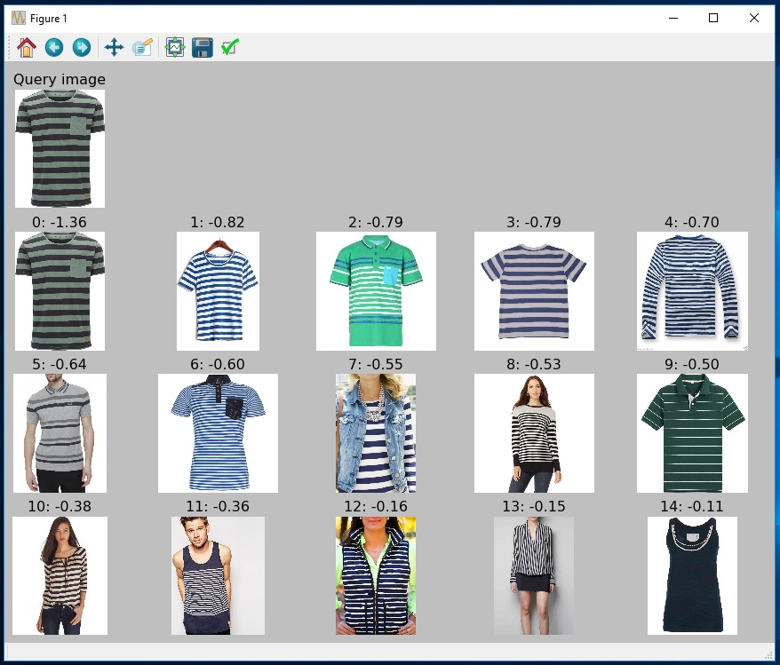
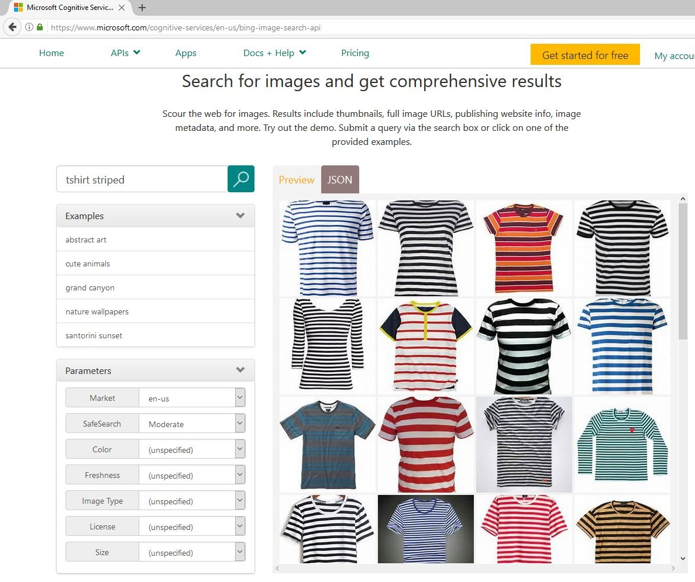

Image Similarity Ranking using Microsoft Cognitive Toolkit (CNTK)
==============


DESCRIPTION
--------------

A large number of problems in the computer vision domain can be solved by ranking images according to their similarity. For example retail companies want to show customers products which are similar to the ones bought in the past. Or companies with large amounts of data want to organize and search their images effectively.

This tutorial will address solving such problems. We will show how to train and test your own image similarity ranker using [Microsoft Cognitive Toolkit (CNTK)](https://github.com/Microsoft/CNTK). Example images and annotations are provided, but the reader can also bring their own dataset and train their own unique ranker.

Traditionally, computer vision solutions required expert knowledge to identify and implement so called “features” which highlight desired information in images. This changed in 2012 with the famous [AlexNet](https://papers.nips.cc/paper/4824-imagenet-classification-with-deep-convolutional-neural-networks.pdf) paper, and at present, Deep Neural Networks (DNN) are used to automatically find these features. DNNs lead to a huge improvement in the field and can be used for a large range of problems, including image classification, object detection, or image similarity.

The tutorial is split into three parts:
-	[Part 1](#part-1) shows how to train and evaluate an image similarity ranking system using the provided example data.
-	[Part 2](#part-2) covers how to annotate your own dataset by scraping images from the net, how to use these images to train an image similarity model for your specific use case, and what parameters and design decisions are important to achieve good results.
-	[Part 3](#part-3) illustrates how to publish the trained model as a web service or Rest API to Azure.

While previous experience with machine learning and CNTK is not required, it is very helpful for understanding the underlying principles covered in this tutorial. Note that accuracy numbers, training time, etc. reported in this tutorial are only for reference, and the actual values you might see when running the code may differ.


PREREQUISITES
--------------

This code was tested using CNTK 2.0.0, and assumes that CNTK was installed with the (default) Anaconda Python interpreter using the script-driven installation. Note that the code will not run on previous CNTK versions due to breaking changes.

A dedicated GPU, while technically not being required, is however recommended for refining of the DNN. If you lack a strong GPU, don't want to install CNTK yourself, or want to train on multiple GPUs, then consider using Azure's Data Science Virtual Machine. See the [Deep Learning Toolkit](https://azuremarketplace.microsoft.com/en-us/marketplace/apps/microsoft-ads.dsvm-deep-learning) for a 1-click deployment solution.

CNTK can be easily installed by following the instructions on the [setup page](https://github.com/Microsoft/CNTK/wiki/Setup-Windows-Binary-Script). This will also automatically add an Anaconda Python distribution. At the time of writing, the default python version is 3.5 64bit.

Anaconda comes with many packages already pre-installed. The only missing packages are opencv and scikit-learn. These can be installed easily using *pip* by opening a command prompt and running:
````bash
C:/local/CNTK-2-0-rc1/cntk/Scripts/cntkpy35.bat #activate CNTK's python environment
cd resources/python35_64bit_requirements/
pip.exe install -r requirements.txt
````

In the code snippet above, we assumed that the CNTK root directory is  *C:/local/CNTK-2-0-rc1/*. The opencv python wheel was originally downloaded from this [page](http://www.lfd.uci.edu/~gohlke/pythonlibs/).

Troubleshooting:
- The error "Batch normalization training on CPU is not yet implemented" is thrown when trying to train the DNN using a CPU-only system. This is due to CNTK currently only providing CPU support for running, though not training, batch normalized networks. To skip training and hence avoid this error set `rf_maxEpochs` to zero in `PARAMETERS.py`.  


FOLDER STRUCTURE
--------------

|Folder| Description
|---|---
|/|				Root directory
|/doc/|	Plots, diagrams, etc. used in this readme page
|/resources/|		  Directory containing all provided resources
|/resources/cntk/|   Pre-trained ResNet model
|/resources/python35_64_bit_requirements/|   Python wheels and requirements file for 64bit Python version 3.5

<!--
|/data/|			Directory containing the image dataset(s)
|/data/fashionTexture/|			Upper body clothing texture dataset
|/resources/python34_64_bit_requirements/|   Python wheels and requirements file for 64bit Python version 3.4
-->

All scripts used in this tutorial are located in the root directory.


PART 1
--------------

In the first part of this tutorial we train and evaluate an image similarity ranking system using the provided example data. First, our approach is explained and the provided image set introduced. This is followed by a description of the scripts which do the actual work. These scripts should be executed in order, and we recommend after each step to inspect which files are written and where they are written to.

Note that all important parameters are specified, and a short explanation provided, in a single place: the `PARAMETERS.py` file.


### Overview

The approach we follow in this tutorial is visualized at a high-level in this diagram:
<p align="center">

</p>

- Given two images on the left, our goal is to measure the visual distance between them. Note that we use the terms *distance* and *similarity* interchangeably, since similarity can be computed e.g. by simply taking the negative of the distance.

- In a pre-processing step, one can first detect the object-of-interest in the image and then crop the image to just that area. This step is optional and not described in this tutorial. Please refer to our [Fast R-CNN Object Detection tutorial](https://github.com/Azure/ObjectDetectionUsingCntk) for an in-depth description of how to train and evaluate such a model.

- Each (possibly cropped) image is then represented using the output of a DNN which was pre-trained on millions of images. The input to the DNN is simply the image itself, and the output is the penultimate layer which, for the ResNet-18 model used in this tutorial, consists of 512-floats.

- These 512-floats image representations are then scaled to each have an L2 norm of one, and the visual distance between two images is defined as a function of their respective 512-floats vectors. Possible distance metrics include the L1 or L2 norm, or the cosine similarity (which technically is not a metric). The advantage of these metrics is that they are non-parametric and therefore do not require any training. The disadvantage however is that each of the 512 dimensions is assumed to carry the same amount of information which in practice is not true. Hence we use a Linear SVM to train a weighted L2 distance, which can give a higher weight to informative dimensions, and vice versa down-weigh dimensions with little or no information.

- Finally, the output of the system is the desired visual similarity for the given image pair.

Representing images as the output of a DNN is a powerful approach and shown to give good results on a wide variety of tasks. The best results however can be achieved through fine-tuning the network before computing the image representations. This approach is also known as transfer learning: starting with an original model which was trained on a very large number of generic images, we use a small set of images from our own dataset to fine-tune this network. A more detailed description of transfer learning can be found on Microsoft Cognitive Toolkit's (CNTK) [Transfer Learning Tutorial](https://github.com/Microsoft/CNTK/wiki/Build-your-own-image-classifier-using-Transfer-Learning) page (we actually borrow some code from there), or in the [Embarrassingly Parallel Image Classification](
https://blogs.technet.microsoft.com/machinelearning/2017/04/12/embarrassingly-parallel-image-classification-using-cognitive-toolkit-tensorflow-on-azure-hdinsight-spark/) blog.


### Image data
`Script: 0_downloadImages.py`

This tutorial uses as running example a small upper body clothing texture dataset consisting of up to 428 images, where each image is annotated as one of 3 different textures (dotted, striped, leopard). All images were scraped using Bing Image Search and hand-annotated as is explained in [Part 2](#using-a-custom-dataset). The image URLs with their respective attributes are listed in the */resources/fashionTextureUrls.tsv* file.

The script `0_downloadImages.py` needs to be executed once and downloads all images to the */data/fashionTexture/* directory. Note that some of the 428 URLs are likely broken - this is not an issue, and just means that we have slightly fewer images for training and testing.

The figure below shows examples for the attributes dotted (left two columns), striped (middle two columns), and leopard (right two columns). Note that annotations were done according to the upper body clothing item, and the classifier needs to learn to focus on the relevant part of the image and to ignore all other areas (e.g. pants, shoes).

<p align="center">



</p>


### STEP 1: Data preparation
`Script: 1_prepareData.py`

This script mainly serves three purposes:

1. All images are assigned to be used either for training or for testing. This assignment is mutually exclusive - no training image is also used for testing or vice versa. We use a ratio of 0.75, meaning 75% of the images from each attribute are assigned to training, and the remaining 25% to testing.

2. This assignment of images into training or testing can be used directly to define a training and test set of (image,label) tuples which will be used in step 2 to refine the DNN.

3. To train the SVM in step 4, and to evaluate the final system in step 5, we need positive and negative image pairs. Positive here refers to two images with the same attribute, and negative refers to two images of different attributes (see figure below). For the training / test set of image pairs, only images assigned to training / test are used.

    For training, we select up to N=100 query images from each of the 3 attributes. Each query image is paired with one image from the same attribute, and up to 99 images from other attributes. This leads to a maximum of 100\*3\*100 = 30,000 mostly negative image pairs. For testing, the same approach is used, however with N set to 20.

    Randomly generated image pairs for the query image in the top row: (left) positive pair since the clothing texture in both images is dotted; (middle and right) negative pairs where the images have different textures.

    <p align="center">
    
    
    
    </p>

Output of the `1_prepareData.py` script. Note how first images are assigned to either training or testing. This is followed by image pair generation for the training and test set. Finally a sanity check confirms that the training and test set have no image in common. All data generated by the script is saved in the *proc/fashionTexture/* folder.

<p align="center">

</p>


### STEP 2: Refining the Deep Neural Network
`Script: 2_refineDNN.py`

The script `2_refineDNN.py` refines a pre-trained Resnet-18 model using the training and test set from step 1 (purpose 2). As was explained in the [Overview](#overview) section, the main difference between DNN refinement and standard DNN training is how the network weights are being initialized: standard training uses randomly sampled values, while refinement uses the weights from a pre-trained network as initialization. The script runs 45 epochs, reports the accuracy on the training and test sets after each epoch, and finally writes the refined model to *proc/grocery/cntkFiles/cntk.model*.

In addition, a plot like the one below is drawn which shows how the training and test classification errors change as a function of the number of training epochs. Note that the error of the final model on the training set is much smaller than on the test set. This so-called over-fitting behavior can be reduced e.g. by using a higher value for the dropout rate `rf_dropoutRate`.
<p align="center">

</p>

DNN training is very slow without GPU acceleration, and furthermore CNTK currently does not support CPU-only training of batch normalized networks. The script should write the string "Using GPU for training" to the console - if this is not the case then either no GPU was found or the GPU is locked (e.g. by a previous CNTK run). Optionally, one can skip model refinement altogether by setting the `rf_maxEpochs` variable to 0.


### STEP 3: Featurize each image using the refined DNN
`Script: 3_featurizeImages.py`

We can now use the refined DNN from the last step to compute a deep representation for all our images. Given an image as input to the DNN, the output is the 512-floats vector from the penultimate layer of the model. This vector, while having much smaller dimensions than the image itself, should nevertheless contain (and even highlight) all information in the image relevant to recognize what attribute the image belongs to, i.e. if the clothing item has a dotted, striped, or leopard texture.

All of the DNN image representations are saved to the file *proc/grocery/cntkFiles/features.pickle*.


### STEP 4: Classifier training
`Script: 4_trainSvm.py`

The 512-floats representations computed in the last step are now used to measure visual similarity between any two images. This is achieved using a metric which takes the 512-floats vectors for two images as input, and outputs a similarity or distance score. Possible metrics include the L1 or L2 norm or the cosine similarity (not technically not a metric). Alternatively, as will be introduced now, a weighted L2 distance can be learned where the weights are obtained by training a Linear SVM.

We phrase the learning problem as a binary image classification task, and use the image pairs from step 1 (purpose 3) for training and evaluation. Given an image pair as input, the SVM is trained to predict if the two images have the same (positive) or a different (negative) clothing texture.

Script `4_trainSvm.py` loads these image pairs and runs the SVM training, with optionally (by default deactivated) multiple iterations of hard negative mining. The classification accuracy is then printed to the console for both the training set and the test set. For the provided texture data these values should be around 93% and 81% respectively. Next, the SVM is calibrated using a technique called Platt Scaling to output not just a score, but also a mapping from score to probability (see figure below). This probability will come in handy when multiple similarity scores need to be combined, as is discussed in part 2. Finally, the trained SVM is written to the file *proc/grocery/cntkFiles/svm.np*.

<p align="center">

</p>

For the reader interested in more details how the weighted L2 distance is trained: given two images and their 512-floats DNN representations *v* and *u*, both vectors are first normalized to have a L2 norm of one, and the input to the SVM is then defined as the per-element squared difference of *v* and *u* (similar to right half of the equation below). The trained linear SVM can then be used as weights *w* in the definition of the weighted L2 distance:
<p align="center">

</p>

<!--
 shown below, where the sum adds up the weighted contribution from each of the 512 dimensions:

score = \sum_i w_i(v_i-u_i)^2
-->


### STEP 5: Evaluation and visualization
`Scripts: 5_evaluate.py`

The accuracy of the image ranking system can be measured using script `5_evaluate.py`. This uses the test image pairs from step 1 (purpose 3) where each query image is paired with 1 positive and 99 negative images. These 100 'reference' images are sorted using their distance to the query image, and the rank of the positive image within the 100 images is computed. Rank 1 corresponds to the best possible result, rank 100 to the worst, and random guessing would on average produce a rank of 50. See the example in the diagram below, where, after sorting, the positive image has rank 3:

<p align="center">

</p>

The ranks for all query images are then aggregated into measures such as the median or mean rank, or the probability of how often the positive images are ranked at the top (top1 accuracy) or within the top 5 (top5 accuracy).

The output of script `5_evaluate.py` is shown below. In this example there is little benefit from learning a weighting of the L2 distance - this is mainly due to the low number of training images in the texture dataset. The top1 accuracy as well as the mean rank are susceptible to outliers and should be taken with a grain of salt. These results improve significantly when using a higher input resolution `rf_inputResoluton = 1000` and a higher dropout rate `rf_dropoutRate = 0.9`, however DNN refinement becomes much slower.

<p align="center">

</p>

In addition to quantitative results, also qualitative visualizations are produced for each query image (see figure below). The query image (left) is compared to all reference images and the reference image with lowest distance shown (middle), as well as the positive reference image (right). In the best case scenario where the positive image has the lowest distance, both the middle and right will show the same image.

<p align="center">

</p>

A note about ground truth quality: even a low number of wrongly annotated or ambiguous images can lead to a significant reduction in accuracy. For example, given a 1% annotation error rate, statistically 1 of the 99 negative reference images in the example above would actually have the same attribute as the query image and compete with the single positive example for the top rank. Hence, even a 1% annotation error rate in this somewhat simplified example would already lead to a reduction / under-estimate of the top1 error by one half.

### Optional: Image Retrieval
`Scripts: A1_imageRetrieval.py`

Example implementation where the user can specify a (query) image, the image is then featurized using the refined DNN and compared to all other images in the test set. See below the query image in the top left, and the most similar 15 images from top to bottom, left to right, with their respective distance to the query image (which can be negative for the weighted L2 distance).

<p align="center">

</p>

### Optional: Image featurization
`Scripts: A2_featurizeImagesInDir.py`

It is often necessary to featurize a large set of images. The script `A2_featurizeImagesInDir.py` implements this, and featurizes each image in a directory using a user-specified DNN.


PART 2
--------------
In part 1, we trained and evaluated an image ranking model using the provided example images of upper body clothing textures. We will now show how to use a custom user-provided dataset instead, and if not available, how to generate and annotate such a dataset using Bing Image Search.

### Using a custom dataset

First, lets have a look at the folder structure for the clothing texture data: Note how all images for the different attributes are in the respective subfolders *dotted*, *leopard* and *striped* at *data/fashionTexture/*. Note also how the image folder name also occurs in the `PARAMETERS.py` file:
```python
datasetName = "fashionTexture"
```

Using a custom dataset is as simple as reproducing this folder structure where all images are in subfolders according to their attribute, and to copy these subfolders to a new user-specified directory *data/newDataSetName/*. The only code change required is to set the `datasetName` variable to *newDataSetName*. Scripts 1-5 can then be executed in order, and all intermediate files will be written to *proc/newDataSetName/* and *results/newDataSetName/*. No other code changes a required (except the typical tweaking of parameters to improve results).

It is important that the new dataset is generated such that each image can be assigned to exactly one attribute. For example, it would be wrong to have attributes for 'animal' and for 'leopard', since a 'leopard' image would automatically also belong to 'animal'. This restriction is due to how positive and negative training and test examples are defined in step 1. Also, it is best to remove images which are ambiguous and hence difficult to annotate.


### Image Scraping and Annotation

Collecting a sufficiently large number of annotated images for training and testing can be difficult. One way to over-come this problem is to scrape images from the Internet. For example, see below the Bing Image Search results for the query "tshirt striped". As expected, most images indeed are striped t-shirts, and the few incorrect or ambiguous images (such as column 1, row 1; or column 3, row 2) can be identified and removed easily:
<p align="center">

</p>

To generate a large and diverse dataset, multiple queries should be used. For example 7\*3 = 21 queries can by synthesized automatically using all combinations of clothing items {blouse, hoodie, pullover, sweater, shirt, tshirt, vest} and attributes {striped, dotted, leopard}. Downloading the top 50 images per query would then lead to a maximum of 21*50=1050 images.

Rather than manually downloading images from Bing Image Search, it is much easier to instead use the [Cognitive Services Bing Image Search API](https://www.microsoft.com/cognitive-services/en-us/bing-image-search-api) which returns a set of image URLs given a query string:
<p align="center">

</p>

Some of the downloaded images will be exact or near duplicates (e.g. differ just by image resolution or jpg artifacts) and should be removed so that the training and test split do not contain the same images. This can be achieved using a hashing-based approach which works in two steps: (i) first, the hash string is computed for all images; (ii) in a second pass over the images, only those are kept with a hash string which has not yet been seen. All other images are discarded. We found the *dhash* approach in the Python library *imagehash* and described in this [blog](http://www.hackerfactor.com/blog/index.php?/archives/529-Kind-of-Like-That.html) to perform well, with the parameter `hash_size` set to 16. It is OK to incorrectly remove some non-duplicates images, as long as the majority of the real duplicates get removed.


### How to get good results

As is true for most machine learning projects, getting good results for a new dataset requires careful parameter tuning as well as evaluating different design decisions. To help with this, all important parameters are specified, and a short explanation provided, in a single place: the `PARAMETERS.py` file.

Some of the most promising avenues for improvements are:

- Data quality: ensure the training and test sets have high quality. That is, the images are annotated correctly, ambiguous images removed (e.g. clothing items with both stripes and dots), and the attributes are mutually exclusive (i.e. chosen such that each image belongs to exactly one attribute).
- Object detection: if the object-of-interest is small and/or at changing positions in the image, then consider adding a [Fast R-CNN Object Detection](https://github.com/Azure/ObjectDetectionUsingCntk) pre-processing step to crop each image to the detected position of the object.
- DNN refinement: try tweaking the learning rate `rf_lrPerMb` and the dropout rate `rf_dropoutRate` during DNN refinement. The other parameters starting with `rf_` are less important, with the possible exception of the minibatch size `rf_mbSize`. Typically, the training error should decrement exponentially and be close to 0% after training (or higher when using a large dropout rate).
- DNN over-fitting: avoid a large gap between the training and test accuracy in the plot from [step 2](#step-2:-refining-the-deep-neural-network). This gap can be reduced using dropout rates `rf_dropoutRate` of 0.5 or more, and by increasing the regularizer weight `rf_l2RegWeight`. Using a high dropout rate can be especially helpful if the DNN input image resolution is high.
- Input resolution: using higher image resolution (parameter: `rf_inputResoluton`) of 500\*500 or 1000\*1000 pixels can significant improve accuracy but slows down DNN refinement and can lead to more over-fitting during DNN refinement. Using a higher dropout rate can help with this.
- DNN depth: try using a deeper network such as ResNet-34 or ResNet-50, however in our experiments deeper networks only perform slightly better. ResNet-50 has the advantage that its penultimate layer is wider and hence produces a larger representation for each image of 2048 floats (vs. 512 for the shallower ResNet architectures). Pre-trained networks can be downloaded from CNTK's [ResNet](https://github.com/Microsoft/CNTK/tree/master/Examples/Image/Classification/ResNet) page.
- SVM training: try using hard negative mining (parameter: `svm_hardNegMining_nrIterations`) to improve the SVM accuracy. Keep in mind thought that this tends to find wrongly annotated images if present.
- Non-linear classifier: replace the SVM / weighted L2 distance with a non-linear classifier. While theoretically more powerful, in our experiments this did not improve accuracy much but slowed down training and scoring significantly.

Finally, note that higher/lower DNN refinement accuracy in step 2 does not necessarily lead to higher/lower ranking accuracy in step 5. Hence it is important to execute all the scripts when testing different parameters or design decisions.


### Combining individual similarities

So far we considered ranking images according to a single criteria: clothing texture. However, one might want to measure similarity using multiple attributes such as texture, neck style, sleeve length, etc. Annotating all these attributes for all images would take a very long time and also cannot be done (semi-)automatically using Bing Image Search as introduced earlier.

Instead, we propose to train multiple similarity rankers independently for all attributes as described in this tutorial, and then to merge the individual distances in a post-processing step to obtain a single similarity measure. This allows to build and tweak all components individually, and add new attributes as required.

Merging multiple individual distances can be achieved using simple (possibly weighted) averaging. This however needs to be done in the probability space defined by the mapping from score to probability (see [step 4](#step-4:-classifier-training)) to avoid errors like the one illustrated in the table below. The table shows an example where a given query image is compared to two reference images, one of which has the same attribute as the query image (and hence should be assigned a higher similarity). Note how the first image has very low similarity scores for texture and for sleeve length, however the average is higher than that of image 2 and hence image 1 is erroneously considered to be more like the query image.

|Image ID| Same attributes as query image | Similarity (texture) | Similarity (neck style) | Similarity (sleeve length) | AVERAGE |
|---|---|---|---|---|---|
|1 |No  | 0.2 | 1.9 | 0.3  | **0.80** |
|2 |Yes | 0.7 | 0.8 | 0.7  | **0.73** |

However, when first mapping the scores to probabilities, then the average of image 2 is higher:

|Image ID| Same attributes as query image | Similarity (texture) | Similarity (neck style) | Similarity (sleeve length) | AVERAGE |
|---|---|---|---|---|---|
|1 |No  | 15% | 99%   | 20%  | **45%** |
|2 |Yes | 78% | 85%   | 78%  | **80%** |


PART 3
--------------

The final part of this tutorial is about publishing the trained image similarity system as a web service or Rest API to Azure. For this we recommend using a technology called Flask, which makes it easy to run Python code in the cloud.

In practice, the image dataset is often fixed which means that the DNN features can be computed offline and then uploaded to the website. In this case CNTK does not need not be executed within Flask, and the tutorial [Creating web apps with Flask in Azure](https://azure.microsoft.com/en-us/documentation/articles/web-sites-python-create-deploy-flask-app/) can be followed for step-by-step instructions.

If the CNTK model needs to run as part of the website (e.g. to compute the DNN features for a newly uploaded image), then Flask can still be used however making it work is slightly more involved. The reason is that CNTK requires the 64bit version of Python, which however is not supported out-of-the-box on Azure Flask. For instructions of how to run CNTK inside a webservice on Azure see the GitHub repo [Azure-WebApp-w-CNTK](https://github.com/ilkarman/Azure-WebApp-w-CNTK).

<!--
TECHNOLOGY
--------------
### Platt Scaling
-->

Contributing
--------------
This project has adopted the [Microsoft Open Source Code of Conduct](https://opensource.microsoft.com/codeofconduct/). For more information see the [Code of Conduct FAQ](https://opensource.microsoft.com/codeofconduct/faq/) or contact [opencode@microsoft.com](mailto:opencode@microsoft.com) with any additional questions or comments.


AUTHOR
---------------
Patrick Buehler, Senior Data Scientist
